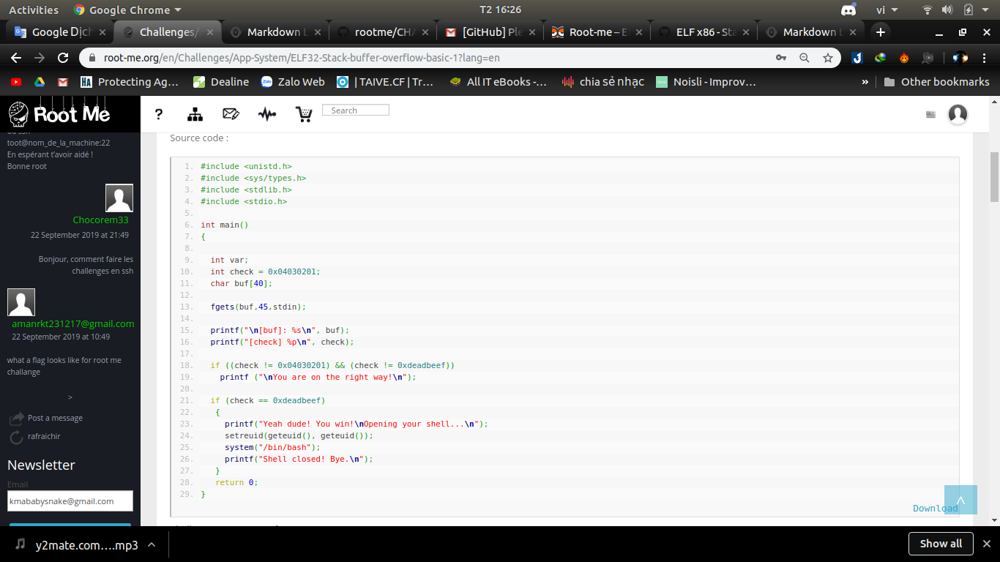
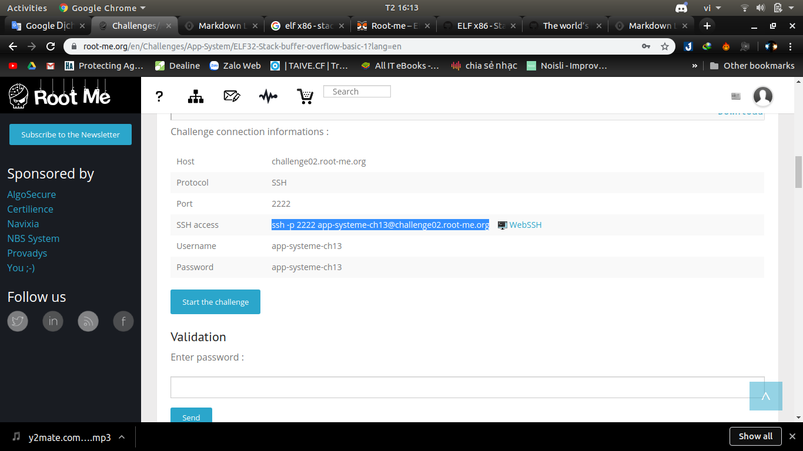
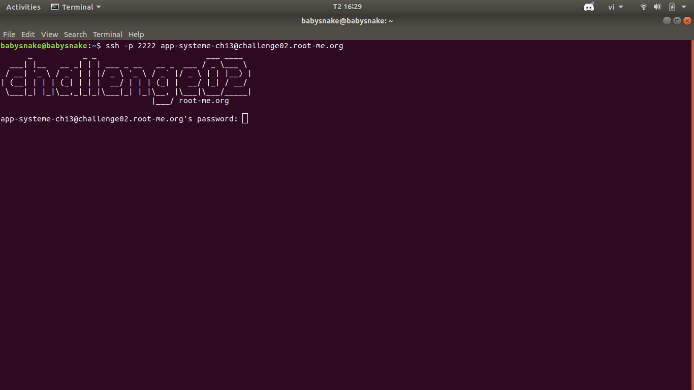
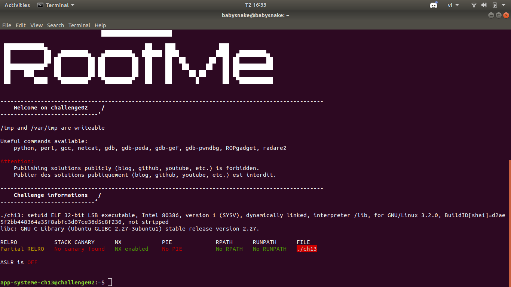
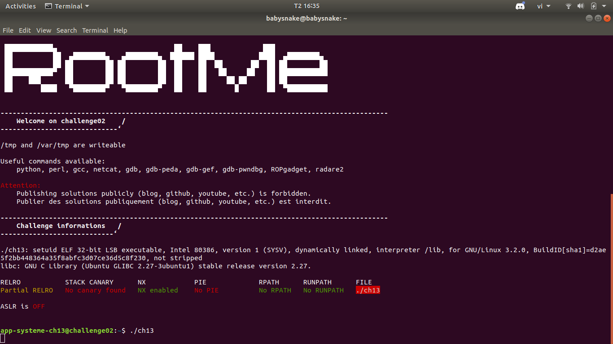
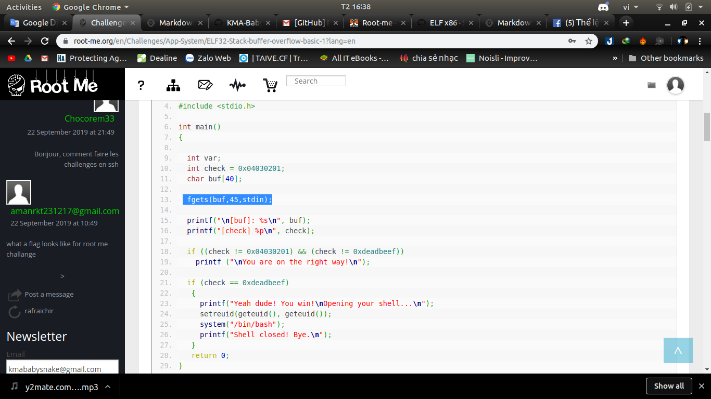
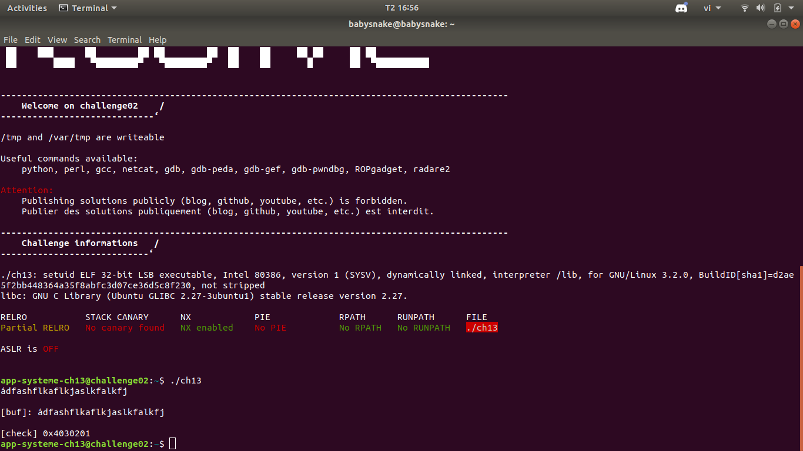
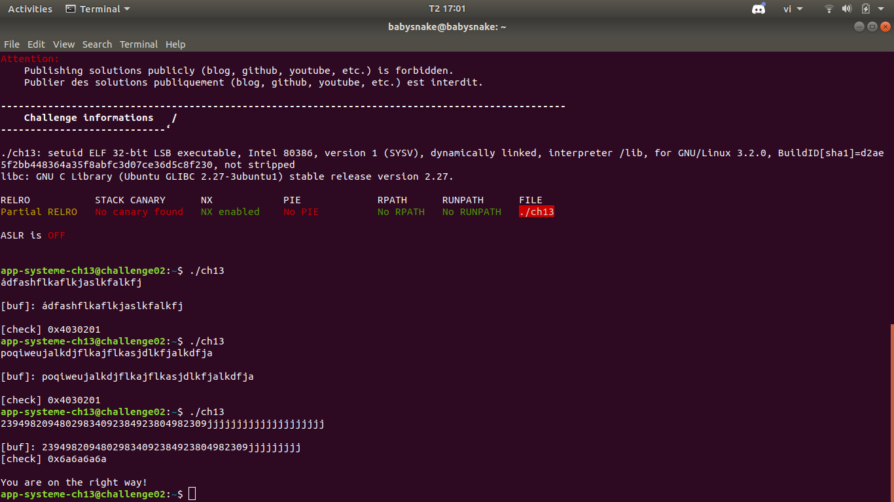
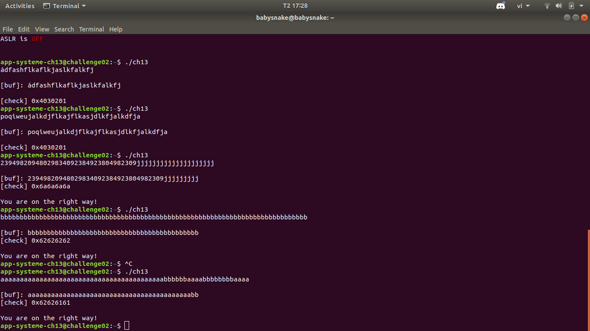
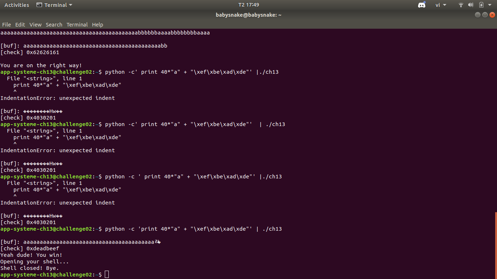

# ELF x86 - Stack buffer overflow basic 1 solution
*An intermediate level to familiarize yourself with* **stack overflows**
Ngay từ đầu thì đề bài đã đưa ra lỗi **stack overflows** gọi là tràn bộ nhớ stack(lỗi tràn ngăn xếp), bạn có thể tìm hiểu về nó và sau khi tìm hiểu thì bài này k còn là vấn đề nữa

[lỗi stack overflows](https://vi.wikipedia.org/wiki/L%E1%BB%97i_tr%C3%A0n_ng%C4%83n_x%E1%BA%BFp)

Đọc phần code ban đầu



Nếu là 1 người mới bắt đầu thì có thể bạn chưa thấy gì hay k đọc nó kĩ củng k sao bây giờ kéo xuống 



ta sẽ mở teminal lên nhập ssh để truy cập thự hiện lệnh

ssh -p 2222 app-systeme-ch13@challenge02.root-me.org 



màng hình yêu cầu pass thì nhập thoi (pass:"app-systeme-ch13" ở phần Challenge connection informations trên web)

nhập pass xong ta sẽ như vầy



nhập './ch13' để vào file code 



Quay lại code ta thấy ta sẽ nhập giá trị vào biến **buf** Điều đặc biệt ở đây là buf được khai báo dạng chuỗi gồm **40** kí tự nhưng khi **nhập vào** thì code lại cho nhập đến **45** kí tự Điều này tạo điều kiện cũng chính là lỗi cốt yếu trong bài này. 

Và 1 điều nữa là biến **check** lại khai báo trước biến **buf** nên trong bộ nhớ lưu trữ thì biến check sẽ ở phía trước và buf sẽ ở liền kề phía sau ( Nếu không hiểu thì bạn phải coi lại [lỗi stack overflows](https://vi.wikipedia.org/wiki/L%E1%BB%97i_tr%C3%A0n_ng%C4%83n_x%E1%BA%BFp))

Đọc kĩ code ở hai câu **if** thì bạn sẽ nhận ra là làm thế nào đó để thay đổi giá trị của biến **check** trở thành **0xdeadbeef** để có thể mở file và lấy flag (nếu bạn đã đọc sơ về lỗi tràn ngăn xếp thì chắc đã biết cách làm)

Thử nhập vào <=40 kí tự thử xem 



biến **check** vẫn k thay đổi (check = 0x04030201) 
Nhập số kí tự hơn 40 



**You are on right way !**

điều thay đổi quan trọng ở đây đó là biến **check** đã thay đổi thành **0x6a6a6a6a**
Thử nhập thêm 1 lần nữa 



NHận thấy là phần nhập **jjjjjjjjjjjjjjjjjjjj** nó đã qua biến **check** 1 phần và giá trị của nó biến thành **0x6a6a6a6a** 

tương tự  **bbbbaaaa** qua **check** nó biến thành **0x62626161**

=> Từ hai cái trên nếu có kinh nghiệm thì ta sẽ nhận ra là nó đã bị chuyển đổi theo nguyên lý là cứ hai kí tự liên tiếp nhau sẽ chuyển đổi thành bộ mã **hex** và nó nhập vào ngược (có nghĩa là 62 tương ứng vs a còn 61 tương ứng với b)
Nhập đoạn mã sau đây 

``` python -c 'print 40*"a" + "\xef\xbe\xad\xde"' | ./ch13 ```

**\x** là cách để chương trình hiểu là hai ký tự tiếp theo được hiểu là các chữ số hex 
[link về \x](https://stackoverflow.com/questions/2672326/what-does-a-leading-x-mean-in-a-python-string-xaa)



vấn đề tiếp theo là ta việc đóng và mở file diễn ra đồng thời nên ta không thể lấy thông tin được nên
nên ta dùng lệnh [cat](https://mike632t.wordpress.com/2016/03/22/implementing-cat-in-python/) dùng để đọc file kí tự 
thêm code vào phần trên 
``` cat <(python -c 'print 40*"a" + "\xef\xbe\xad\xde"') - | ./ch13 ```
sau đó nhập 
``` cat ./.passwd ```
ta đã có flag là : **1w4ntm0r3pr0np1s**
